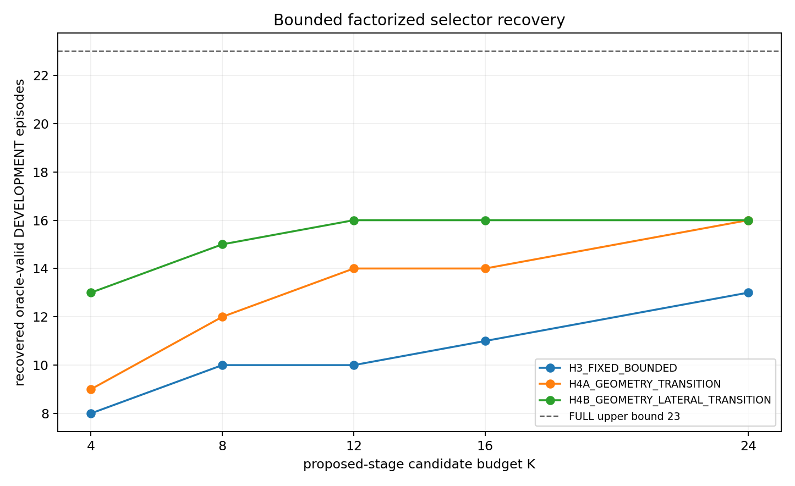
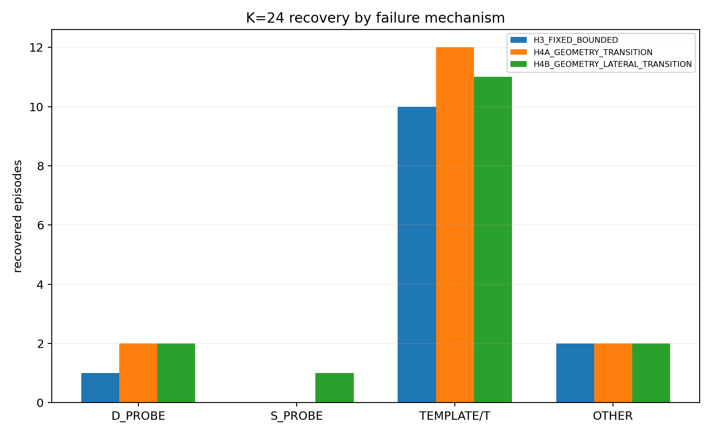
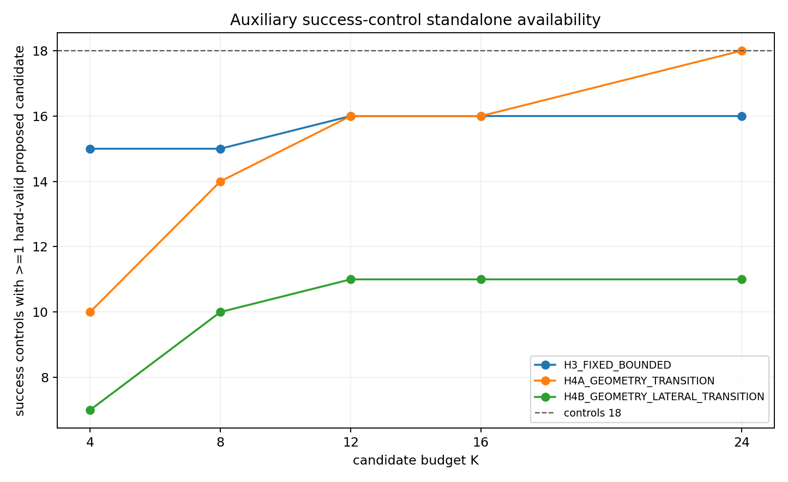

# Geometry-conditioned bounded factorized P3 — DEVELOPMENT prototype v1

## 결론

`PILOT_SEEN_DEVELOPMENT_DATA`와 `DEVELOPMENT`만 사용해, 기존 P3 자유도 안에서 작은 고정 budget의 factorized candidate stage를 설계하고 exact production validator로 평가했다. `VALIDATION_UNSEEN`과 `FINAL_HOLDOUT_UNSEEN`은 열지 않았고 dataset split도 바꾸지 않았다.

DEVELOPMENT에서 동결할 primary prototype은 **`H4A_GEOMETRY_TRANSITION`, K=24**다. production이 먼저 실행되고 hard-valid candidate가 없을 때만 이 stage를 실행하는 fallback 구조다. 23개 oracle-valid production-failure episode 중 **16개(69.6%)**를 회복했다. 효율 ablation은 **`H4B_GEOMETRY_LATERAL_TRANSITION`, K=12**이며 같은 16/23을 절반의 tuple budget으로 회복했지만, 보조 success control에서 standalone hard-valid availability가 11/18뿐이어서 primary로 선택하지 않았다.

이 결과는 DEVELOPMENT prototype 결과다. unseen 일반화, closed-loop 안전성, 실시간 production latency, 논문 novelty를 증명하지 않는다. production planner, P3 family, analytic solver, validator, ranker, vehicle/collision parameter, lifecycle, speed shaping, YAML은 수정하지 않았다.

## 범위와 누수 방지

- failure evaluation universe: `DVE001..DVE040` DEVELOPMENT 중 full oracle가 기존 P3 family 안의 hard-valid path를 확인한 23개 episode
- online selector input: candidate validation 전에 관측 가능한 ego, obstacle, corridor, reference geometry와 같은 event의 production factor provenance
- online에서 사용하지 않은 값: oracle classification, oracle-valid tuple, hard-valid 결과, first-failure, safety margin
- unseen rows read: 0
- dataset split change: 없음
- exact harness SHA-256: `8b23f2b6df54c2e93794ee087f3ebd7a14f9921544af4f97eef755535e045e7e`

[execution_manifest.json](execution_manifest.json)은 이 실행 범위를 machine-readable하게 기록한다. selector 구현은 [analyze_method.py](analyze_method.py), 동결된 정의의 authority는 [method_spec.json](method_spec.json)이다.

## Factor 정의와 변경하지 않은 경계

완전한 direct P3 candidate를 다음처럼 분해했다.

\[
q=(L,T)=(side,d_{target},d_{mid},\alpha_{entry},\alpha_{exit}).
\]

- lateral factor `L`: side, `d_target`, `d_mid`, target/middle 생성 provenance
- transition factor `T`: entry scale, exit scale, 같은 evaluation의 production transition provenance

Production은 관측된 template 안의 특정 `(L,T)` 결합만 생성한다. 본 prototype은 이 결합만을 허용하던 제한을 풀어, deterministic lateral pool과 **같은 event에서 production이 실제 사용한 transition pair**를 재조합한다. spline 차수, knot/station semantics, reconstruction, hard validator는 그대로다. 다른 transition에 붙인 `d_mid`는 원래 analytic probe equation의 root라는 의미를 더는 보장하지 않으므로, 모든 재조합 path는 exact validator를 다시 통과해야 한다.

Lateral pool은 production lateral tuple/target과 corridor component의 near-inset, 1/4, center, 3/4 anchor를 사용한다. 각 target의 `d_mid` recipe는 target, bottleneck center, target-center half, `0.75 d_target`, `0.5 d_target`이다. 상세 수식과 priority는 [method_spec.md](method_spec.md)에 있다.

## Pre-planning geometry

[geometry_features.csv](geometry_features.csv)에 event-side별로 다음 descriptor를 보존했다.

- ego `d`, speed
- obstacle start distance와 longitudinal span
- inflated obstacle lateral interval
- chosen-side free interval, width
- corridor bottleneck lower/upper, center, width, station
- available entry distance와 visible next obstacle까지의 merge/exit distance
- entry/obstacle/exit reference curvature, max absolute curvature, curvature sign change
- local track-width variation

Next visible obstacle이 없으면 merge distance는 15 m lookahead에서 censor된다. 이 상태는 `available_merge_exit_status`에 명시했다. feature 정의와 단위는 [method_spec.json](method_spec.json), 실제 event-side 값은 [geometry_features.csv](geometry_features.csv)에 있다.

## 세 selector

### H3 — fixed bounded basis

Geometry에 따라 순서를 바꾸지 않는 factorization baseline이다. lateral source priority와 fixed transition archetype 순서 `(short,short)`, `(long,short)`, `(short,long)`, `(long,long)`, `(mid,mid)`를 결합한다.

### H4-A — geometry-conditioned transition

Lateral priority는 고정하고 entry/exit transition만 pre-planning geometry로 정렬한다.

\[
e^*=\begin{cases}
1,&D_{entry}<0.25\ \lor\ |\kappa|_{max}>0.5\ \lor\ D_{obs}>2.0\\
0,&\text{otherwise}
\end{cases}
\]

\[
x^*=\begin{cases}
0,&D_{merge}<2.0\\
1,&D_{merge}\ge 2.0\ \land\ (\text{curvature sign change}\ \lor\ \Delta w_{track}>0.6)\\
0,&\text{otherwise}
\end{cases}
\]

정규화된 transition `(e,x)`에 대해

\[
E_T=|e-e^*|+|x-x^*|,
\qquad score_{H4A}=E_T+0.20P_L.
\]

짧은 entry 또는 큰 reference curvature에서는 긴 entry ramp를, merge 공간이 부족하면 짧은 exit를 우선한다. obstacle이 멀면 긴 entry를 구성할 longitudinal 공간이 있다고 보는 deterministic rule이다.

### H4-B — geometry-conditioned lateral and transition

H4-A의 transition error와 corridor-based lateral target error를 함께 쓴다. bottleneck width `<0.25 m`를 narrow로 보고, obstacle start `>2.0 m`이면 component 3/4 anchor를 target/mid로 삼는다. 그 외에는 narrow이면 bottleneck center, 아니면 near-inset을 target으로 삼고 obstacle span과 narrow 여부로 desired mid를 정한다.

\[
E_L=\frac{|d_t-d_t^*|+|d_m-d_m^*|}{\max(0.1,w_{bottleneck})},
\]

\[
score_{H4B}=E_L+1.5E_T+0.05P_L.
\]

세 hypothesis의 물리적 근거, limitation, DEVELOPMENT evidence는 [selector_hypotheses.md](selector_hypotheses.md)에 정리했다.

## Budget와 exact 평가 계약

각 selector는 score tuple 오름차순으로 정렬한 unique full tuple 중 최대 `K=4,8,12,16,24`개만 reconstruction한다. production이 이미 평가한 exact full tuple은 proposed pool에서 제외했다.

동결 method의 실행 계약은 다음과 같다.

1. exact tuple을 먼저 deduplicate한다.
2. score/tie-break 순서에서 처음 K개만 reconstruction한다.
3. construction guard를 통과한 path의 digest를 계산한다.
4. 동일 digest는 첫 path만 exact validator에 전달한다.
5. production hard-valid가 있으면 proposed stage를 실행하지 않는다.
6. production과 proposed stage가 모두 실패하면 기존 fallback/lifecycle authority를 유지한다.

Audit harness는 reconstruction과 validation을 한 호출에서 수행하므로 duplicate path도 raw 실행에서는 validator를 거쳤다. 따라서 결과는 `raw_harness_validator_execution_count`와 동결 method가 요구하는 `deduplicated_validator_call_count`를 구분한다. 아래 validator 수는 후자다. K는 proposed stage 상한이며 production candidate 수를 포함한 callback-global cap이라는 뜻이 아니다.

## DEVELOPMENT failure 결과

### Budget별 회복과 계산량

| selector | K | 회복/23 | selected tuple 총수 | dedup validator | duplicate path | hard-valid | harness wall p95 |
|---|---:|---:|---:|---:|---:|---:|---:|
| H3 | 4 | 8 | 92 | 80 | 8 | 11 | 23.35 ms |
| H3 | 8 | 10 | 184 | 154 | 19 | 20 | 19.79 ms |
| H3 | 12 | 10 | 276 | 219 | 33 | 30 | 21.03 ms |
| H3 | 16 | 11 | 368 | 289 | 40 | 40 | 21.95 ms |
| H3 | 24 | 13 | 550 | 415 | 57 | 58 | 21.00 ms |
| H4-A | 4 | 9 | 92 | 87 | 0 | 17 | 18.15 ms |
| H4-A | 8 | 12 | 184 | 168 | 0 | 26 | 21.17 ms |
| H4-A | 12 | 14 | 276 | 237 | 2 | 36 | 21.83 ms |
| H4-A | 16 | 14 | 368 | 295 | 4 | 41 | 22.87 ms |
| **H4-A** | **24** | **16** | **550** | **411** | **25** | **55** | **22.38 ms** |
| H4-B | 4 | 13 | 92 | 80 | 0 | 21 | 21.77 ms |
| H4-B | 8 | 15 | 184 | 152 | 0 | 30 | 24.54 ms |
| **H4-B** | **12** | **16** | **276** | **223** | **0** | **42** | **20.08 ms** |
| H4-B | 16 | 16 | 368 | 282 | 2 | 44 | 23.48 ms |
| H4-B | 24 | 16 | 550 | 372 | 28 | 55 | 25.18 ms |

Wall time은 detached exact-harness subprocess, parsing, output 비용을 포함한 진단치다. production callback latency나 real-time guarantee로 해석하면 안 된다. 원자료는 [development_results.csv](development_results.csv), 집계는 [recovery_by_budget.csv](recovery_by_budget.csv)와 [candidate_budget_runtime.csv](candidate_budget_runtime.csv)에 있다.

### Production 및 factorization upper bound와 비교

아래는 같은 23개 oracle-valid DEVELOPMENT failure로 다시 제한한 비교다.

| method | online selectable | 회복/23 | 후보 총수 | per-event p95/max | validator 총수 |
|---|---|---:|---:|---:|---:|
| production | yes | 0 | 175 | 30.0 / 30 | 175 |
| simple uncouple-`d_mid` A | **no; oracle-informed** | 9 | 191 | 30.0 / 32 | 191 |
| transition cross-pair B | yes factors, exhaustive/unbounded | 5 | 2,044 | 600.3 / 667 | 2,044 |
| simple A+B | **no; oracle-informed** | 13 | 2,089 | 626.4 / 667 | 2,089 |
| H3 K=24 | yes | 13 | 550 | 24 / 24 | 415 |
| H4-A K=24 | yes | 16 | 550 | 24 / 24 | 411 |
| H4-B K=12 | yes | 16 | 276 | 12 / 12 | 223 |
| full L×T | **no; oracle-informed upper bound** | 23 | 21,841 | 2,119.9 / 7,440 | 21,841 |

기존 factorization 문서의 full L×T p95 `1,898.05`는 40개 DEVELOPMENT event 전체 분포다. 위 `2,119.9`는 이번 질문의 평가 universe인 23개 oracle-valid failure만 남긴 조건부 분포여서 다르다. candidate-level 근거와 upper-bound 구분은 [comparison_summary.csv](comparison_summary.csv)에 있다.

H4-B K=12는 simple A+B보다 3개 episode를 더 회복하면서 per-event 후보 상한을 667에서 12로 줄였다. 다만 A+B가 oracle lateral 정보를 쓰는 counterfactual이고 H4-B의 threshold도 같은 DEVELOPMENT에서 설계되었으므로, 이는 DEVELOPMENT 내 prototype evidence이지 공정한 unseen 성능 비교가 아니다.

### Failure mechanism별 결과

Primary H4-A K=24:

| mechanism | 회복/전체 | 미회복 event |
|---|---:|---|
| `D_PROBE_DOMINANT` | 2/3 | DVE005 |
| `S_PROBE_DOMINANT` | 0/1 | DVE039 |
| `TEMPLATE_OR_TRANSITION_SELECTION` | 12/13 | DVE029 |
| `OTHER` | 2/6 | DVE002, DVE030, DVE032, DVE037 |

H4-B K=12는 `D_PROBE` 2/3, `S_PROBE` 1/1, template/transition 11/13, OTHER 2/6이다. 미회복은 DVE005, DVE024, DVE029, DVE002, DVE030, DVE032, DVE037이다. 따라서 geometry conditioning은 template/transition coupling을 가장 잘 줄였지만, multi-parameter OTHER와 한 D-probe episode는 계속 남는다. H4-A는 유일한 S-probe episode도 놓친다.

상세 event list는 [recovery_by_failure_mechanism.csv](recovery_by_failure_mechanism.csv), 각 selected tuple의 score input과 digest/result는 [selected_candidates_audit.csv](selected_candidates_audit.csv)에 있다.

## Success-control regression

Frozen failure split에는 production-success row가 없다. split을 바꾸거나 unseen data를 열지 않기 위해, 이미 본 instrumentation-v2 replay에서 모든 frozen failure episode callback 범위 밖의 strict production success를 bag별 SHA-256 오름차순으로 6개씩 선택했다. 세 bag에서 총 18개이며 짧은 `2026-08-25 09:23` bag에는 조건을 만족한 success가 없었다. 이들은 **`PILOT_SEEN_DEVELOPMENT_DATA_SUCCESS_CONTROL_AUXILIARY`**이고 공식 DEVELOPMENT failure split member가 아니다.

모든 control은 exact evaluator lineage를 가지며 production constructed/returned digest multiset reconstruction parity가 18/18이다. 선택 근거와 input SHA는 [success_control_manifest.csv](success_control_manifest.csv), exact input은 [success_control_inputs](success_control_inputs)에 있다.

| selector | K | hard-valid 생성 | production-selected side 보존 | offline dedup validator | slack delta p50/min | footprint margin delta p50/min | obstacle margin delta p50/min |
|---|---:|---:|---:|---:|---:|---:|---:|
| H4-A | 24 | **18/18** | 17/18 | 415 | -0.0052 / -0.0659 | -0.00061 / -0.09082 m | -0.00094 / -0.09880 m |
| H4-B | 12 | 11/18 | 10/18 | 213 | -0.0036 / -0.0606 | -0.00409 / -0.30299 m | +0.14504 / -0.00596 m |

Standalone replacement로 강제하면 H4-A도 한 control에서 production-selected side를 잃고, 일부 best proposed candidate의 margin이 production selected candidate보다 작다. H4-B는 7개 control에서 hard-valid candidate를 생성하지 못하므로 standalone generator로는 더 분명한 regression이 있다.

그러나 동결된 deployment contract는 **production-first**다. 이 18개 success에서 proposed stage는 호출되지 않으므로 실제 추가 validator는 0, selected path 변화도 0이다. 즉 성공 경로 regression을 막는 것은 selector 자체의 동등성이 아니라 fallback 구조다. 이 구조를 제거하면 현재 DEVELOPMENT 증거로는 안전하지 않다.

Per-control 수치는 [success_control_regression.csv](success_control_regression.csv), 집계는 [success_control_summary.csv](success_control_summary.csv)에 있다. 이는 offline regression check이며 closed-loop dynamics, temporal stability, 실제 scheduler/runtime 영향은 검증하지 않는다.

## 동결할 prototype

### Primary: H4A_GEOMETRY_TRANSITION_K24

- factor conditioning: transition only
- lateral basis: method spec의 fixed bounded pool
- proposed-stage budget: K=24
- DEVELOPMENT failure recovery: 16/23
- success-control standalone hard-valid availability: 18/18
- mandatory fallback: production first, production hard-valid이면 proposed stage skip
- tie-break/dedup: [method_spec.json](method_spec.json)의 exact score tuple과 first path-digest rule

### Fallback/efficiency ablation: H4B_GEOMETRY_LATERAL_TRANSITION_K12

- factor conditioning: lateral + transition
- proposed-stage budget: K=12
- DEVELOPMENT failure recovery: 16/23
- success-control standalone hard-valid availability: 11/18
- 용도: 절반 budget에서 lateral conditioning의 효율 기여를 분리하는 ablation

[selected_prototype_spec.json](selected_prototype_spec.json)이 두 선택의 machine-readable freeze record다.

- `method_spec.json` SHA-256: `6f3f5a66fe901ae1121c6e9997332e09a1e0421df09a7da7c1673110e9a69f91`
- `selected_prototype_spec.json` SHA-256: `7e6aad0541b87b1568a82b27f03d2087f31b2c059af4c5380effd25d0a8bd018`
- offline implementation SHA-256: `900a262e49436fa75a1567d49b7823ef4e4cb7f08d313389cd2de26c647c3722`

Sidecar는 [method_spec.sha256](method_spec.sha256)과 [selected_prototype_spec.sha256](selected_prototype_spec.sha256)에 있다.

## 요청된 일곱 질문

1. **Geometry-conditioned selector가 같은 또는 더 작은 budget에서 simple A+B보다 유의하게 더 회복하는가?** DEVELOPMENT에서는 그렇다. H4-B K=12가 16/23으로 oracle-informed A+B의 13/23보다 3개 더 회복했고, per-event 상한은 12 대 667이다. 하지만 unseen 통계적 유의성이나 일반화 주장은 아니다.

2. **K=4/8/12/16/24 회복은?** H3는 `8/10/10/11/13`, H4-A는 `9/12/14/14/16`, H4-B는 `13/15/16/16/16`이다. 분모는 모두 23이다.

3. **23/23 full-factorization upper bound와 얼마나 떨어지는가?** Primary H4-A K=24와 H4-B K=12 모두 16/23(69.6%)으로 7 episode, 30.4 percentage point가 남는다.

4. **Geometry conditioning이 fixed bounded basis보다 실질적으로 나은가?** DEVELOPMENT에서는 그렇다. K=12에서 H3 10/23 대비 H4-A 14/23, H4-B 16/23이고, K=24에서도 H3 13/23 대비 geometry selector 16/23이다.

5. **어떤 mechanism이 남는가?** Primary는 D-probe 1개, S-probe 1개, template/transition 1개, OTHER 4개가 미회복이다. event는 DVE005, DVE039, DVE029, DVE002, DVE030, DVE032, DVE037이다.

6. **Success-control regression이 새 문제를 드러냈는가?** 그렇다. H4-A standalone은 selected-side availability 17/18이고 일부 margin이 감소하며, H4-B standalone은 hard-valid availability가 11/18이다. 따라서 production-first skip-on-success가 필수다. 이 contract 아래에서는 success control 추가 validator와 선택 변화가 모두 0이다.

7. **VALIDATION_UNSEEN 전에 동결할 하나의 primary는?** `H4A_GEOMETRY_TRANSITION_K24`다. exact algorithm, geometry feature, threshold/formula, K, tie-break, dedup, fallback과 SHA는 [selected_prototype_spec.json](selected_prototype_spec.json)에 동결했다. 아직 production 구현 또는 unseen evaluation으로 넘어가지 않았다.

