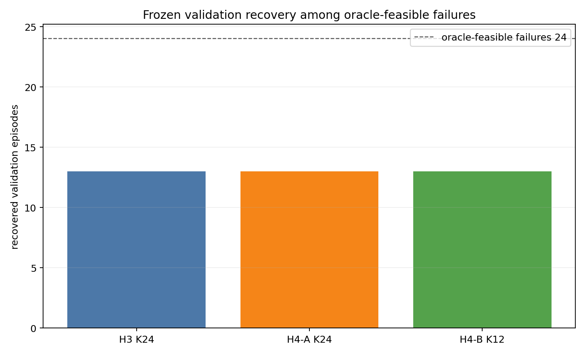
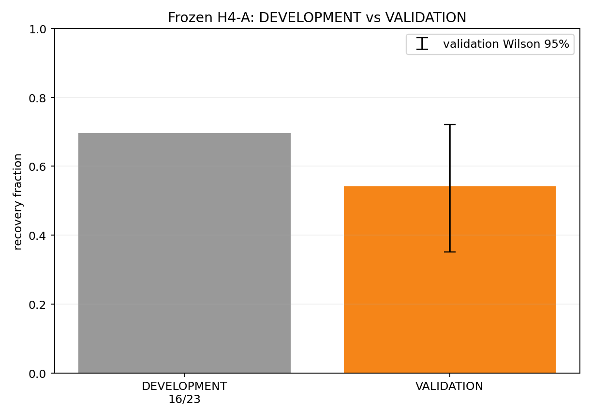
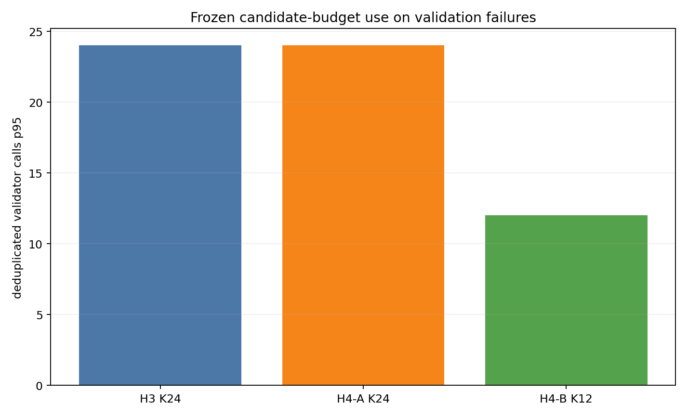
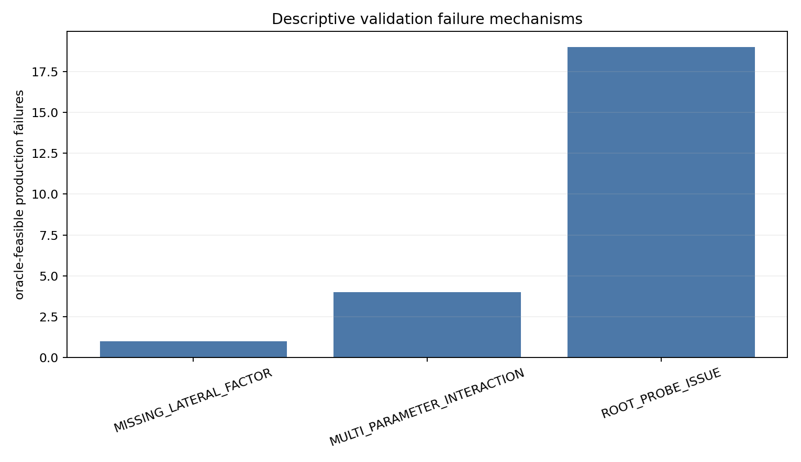

# Frozen H4-A validation v1

## 결론

동결된 `H4A_GEOMETRY_TRANSITION_K24`를 `VALIDATION_UNSEEN` 37개 episode에 처음 적용했다. frozen broad oracle가 hard-valid P3를 찾은 24개 production failure 중 H4-A는 **13개, 54.2%**를 회복했다. DEVELOPMENT의 `16/23 = 69.6%`보다 **15.4 percentage point 낮다**. Validation Wilson 95% interval은 **35.1–72.1%**로 넓으므로 이 차이만으로 overfitting을 단정할 수는 없지만, generalization degradation은 관측됐다.

동일 분모에서 fixed H3 K24도 13/24, H4-B K12도 13/24였다. H4-A와 H3는 12개를 함께 회복하고, H4-A만 VUE027, H3만 VUE013을 회복했다. 따라서 **geometry conditioning이 fixed bounded basis보다 낫다는 DEVELOPMENT의 순회복 우위는 validation에서 재현되지 않았다.**

이 결과만으로 frozen H4-A v1을 proposed primary improvement로 `FINAL_HOLDOUT_UNSEEN`에 진행하는 것은 정당화되지 않는다. 이유는 baseline 우위 부재, success episode가 전혀 없는 validation corpus, adverse diagnostic margin 사례, 그리고 한 건의 broad-oracle search miss다. 이번 작업에서는 H4-A를 수정하거나 재설계하지 않았으며 holdout도 열지 않았다.

## Freeze gate

어떤 validation outcome도 읽기 전에 다음을 확인했다.

| Authority | expected SHA-256 | observed | 결과 |
|---|---|---|---|
| `method_spec.json` | `6f3f5a66fe901ae1121c6e9997332e09a1e0421df09a7da7c1673110e9a69f91` | 동일 | PASS |
| `selected_prototype_spec.json` | `7e6aad0541b87b1568a82b27f03d2087f31b2c059af4c5380effd25d0a8bd018` | 동일 | PASS |
| `dataset_split_manifest.csv` | `c57cfe8e57dfca4bb318d30047e8f7215f6994e88a39babfbdbb10ce7637b2f4` | 동일 | PASS |
| exact validator harness | `8b23f2b6df54c2e93794ee087f3ebd7a14f9921544af4f97eef755535e045e7e` | 동일 | PASS |
| frozen offline method implementation | `900a262e49436fa75a1567d49b7823ef4e4cb7f08d313389cd2de26c647c3722` | 동일 | PASS |
| frozen broad-oracle runner | `ed0d8a54cd8d3e3452c78f336c378f384e60a74f1d641ffd6f05208acdc51198` | 동일 | PASS |

- repository HEAD: `80ae205fd470f537bd1e5449fb906c5548f6653a`
- split seed: `p3_mapping_research_corpus_v1_seed_20260830`
- split algorithm: `episode_iterative_stratification_v1`
- production `src/local_planning` worktree diff: 0 files
- `FINAL_HOLDOUT_UNSEEN` rows loaded/evaluated: 0

[freeze_verification.json](freeze_verification.json)에 source/config SHA를 포함한 전체 provenance를 기록했다. [execution_manifest.json](execution_manifest.json)은 실제 validation 실행 계약과 parity 수를 기록한다.

## Validation corpus와 exact parity

Frozen manifest의 `VALIDATION_UNSEEN` 37개를 모두 사용했다.

| bag | episode 수 |
|---|---:|
| `rosbag2_2026_08_24-19_00_30` | 19 |
| `rosbag2_2026_08_24-19_24_17` | 11 |
| `rosbag2_2026_08_25-09_59_22` | 7 |

37개 모두 frozen production hard-valid count가 0인 failure episode다. 각 episode에서 evaluator-level input/ego/obstacle/reference snapshot ID를 다시 연결하고, production constructed/returned path-digest multiset을 exact harness로 복원했다.

- exact evaluator lineage: 37/37
- constructed digest multiset parity: 37/37
- returned digest multiset parity: 37/37
- production failure: 37/37
- production success: 0/37

따라서 recovery 평가는 가능하지만, production-first contract가 unseen production success를 실제로 skip하는지는 이 split에서 새로 검증할 수 없다. 해당 contract가 변한 것은 아니며 이번 corpus에서 `production_first_prevented_change` count가 0인 이유는 37개 모두 production failure이기 때문이다.

Episode·snapshot·input SHA는 [validation_manifest.csv](validation_manifest.csv)에 있다.

## Oracle classification

동결된 pilot-v2 broad oracle를 37개 production failure에 동일하게 실행했다.

| frozen oracle 결과 | episode 수 |
|---|---:|
| `ORACLE_VALID_P3_EXISTS` | 24 |
| `NO_VALID_P3_FOUND_IN_ORACLE_DOMAIN` | 13 |
| `ORACLE_INCONCLUSIVE` | 0 |

### VUE036 oracle-search exception

VUE036은 broad oracle가 valid sample을 찾지 못했지만, 동결된 H3, H4-A, H4-B가 모두 같은 exact lineage와 validator에서 hard-valid P3를 생성했다. 이는 새로운 search나 tuning 결과가 아니라 validation에 적용한 frozen method 자체의 valid witness다.

따라서 다음 두 지표를 구분한다.

1. **Predeclared central metric:** broad oracle가 직접 검출한 24개를 분모로 사용한다.
2. **Known exact-feasible sensitivity:** VUE036 witness를 포함한 25개를 분모로 사용한다.

`NO_VALID_P3_FOUND_IN_ORACLE_DOMAIN` 13개를 모두 물리적 또는 P3-family infeasible이라고 부르면 안 된다. 한 개는 명백한 oracle sampling miss이고, 나머지 12개도 “동결된 search domain에서 valid를 찾지 못함”까지만 증명한다. 전체 oracle 수치와 witness flag는 [validation_oracle_summary.csv](validation_oracle_summary.csv)에 있다.

## Primary result

### Central metric

| method | K | frozen-oracle feasible 분모 | 회복 | 회복률 | Wilson 95% |
|---|---:|---:|---:|---:|---:|
| production | production | 24 | 0 | 0% | — |
| H3 fixed bounded | 24 | 24 | 13 | 54.2% | 35.1–72.1% |
| **H4-A geometry transition** | **24** | **24** | **13** | **54.2%** | **35.1–72.1%** |
| H4-B geometry lateral+transition | 12 | 24 | 13 | 54.2% | 35.1–72.1% |

Known exact-feasible sensitivity에서는 세 frozen selector 모두 VUE036을 회복하므로 `14/25 = 56.0%`, Wilson 95% `37.1–73.3%`다. Central result를 이 sensitivity 결과로 대체하지 않는다.

### DEVELOPMENT 비교

| corpus | oracle-feasible failures | H4-A recovery | rate |
|---|---:|---:|---:|
| DEVELOPMENT | 23 | 16 | 69.6% |
| VALIDATION_UNSEEN | 24 | 13 | 54.2% |

차이는 `-15.4 pp`다. Validation interval이 DEVELOPMENT point estimate를 포함하므로 작은 표본에서 유의한 성능 저하라고 단정할 근거는 부족하다. 하지만 expected recovery가 낮아졌고 H3와 동률이므로, DEVELOPMENT에서 관측된 geometry-conditioning advantage가 일반화되었다고 말할 수도 없다.

Bag별 H4-A central recovery는 `19:00` bag 6/12, `19:24` bag 5/8, `09:59` bag 2/4다. 회복 자체는 세 input domain 모두에서 나타났다.

## Candidate budget와 runtime

Oracle-feasible 24개에서 H4-A K24:

- selected exact tuples: 576, event당 항상 24
- constructed paths: 446
- construction-guard rejects: 130
- raw harness validator executions: 446
- first-path-digest deduplicated validator calls: 412
- duplicate paths: 34
- hard-valid candidates: 48
- deduplicated validator calls p50/p95/max: 20/24/24
- raw subprocess wall p50/p95/p99/max: 13.43/20.35/22.42/23.00 ms

모든 37개 failure에서도 selected tuple max와 deduplicated validator max가 각각 24다. 따라서 frozen **K=24 상한은 유지**됐다. 이 K는 proposed recovery stage의 상한이며 production 후보를 포함한 callback-global count가 아니다.

Runtime은 detached harness process, parsing, output 비용을 포함한다. Production callback latency나 real-time deadline 결과로 사용하면 안 된다. 전체 수치는 [candidate_budget_runtime.csv](candidate_budget_runtime.csv)에 있다.

## Hard-valid margin과 regression evidence

H4-A가 만든 exact hard-valid selected path는 central 13개와 VUE036 witness를 합쳐 14개다.

| stored margin | min | p50 | p95 |
|---|---:|---:|---:|
| footprint-track margin | 0.00126 m | 0.25791 m | 0.53062 m |
| lateral-slope margin | 0.00454 | 0.56958 | 0.74979 |
| signed-curvature margin | 0.08524 rad/m | 0.50266 rad/m | 0.85912 rad/m |
| curvature-rate margin | 16.653 rad/m² | 18.660 rad/m² | 19.471 rad/m² |
| obstacle diagnostic margin | -0.69217 m | 0.14958 m | 1.50000 m |
| minimum normalized safety slack | -0.46145 | 0.08553 | 0.33413 |

- exact validator가 invalid candidate를 선택한 경우: 0
- positive braking deficit selected path: 0/14
- oracle가 best side를 제공한 회복에서 side match: 13/13
- selected side가 production-generated side set에 포함: 14/14
- `exit_reaches_next_obstacle=1`: 3/14, VUE009/VUE011/VUE014
- negative obstacle diagnostic/slack: 4/14, VUE009/VUE011/VUE014/VUE036

Negative `obstacle_margin`과 normalized slack은 harness가 기록한 aggregate diagnostic이며, 이 14개는 frozen exact validator상 hard-valid다. 따라서 이를 곧바로 hard collision 또는 false validation이라고 해석하지 않는다. 반대로, production fallback에서 실제 주행 path로 전환할 때 안전 regression이 없다고 증명한 것도 아니다. 세 exit-conflict와 네 negative diagnostic 사례는 closed-loop/temporal validation 전 별도 검토가 필요하다.

이번 validation split에는 production success가 없으므로, 기존 success path의 side/margin/validation cost regression을 unseen으로 비교할 수 없다. 결과적으로 **hard-validator 기준 false/unsafe selection은 0이지만 end-to-end regression-free 결론은 보류**한다. Per-event 결과는 [validation_method_results.csv](validation_method_results.csv), margin 집계는 [validation_margin_summary.csv](validation_margin_summary.csv)에 있다.

## Failure mechanism analysis

24개 oracle-detected feasible production failure의 descriptive mechanism과 H4-A 결과는 다음과 같다.

| mechanism | 전체 | H4-A 회복 | 미회복 |
|---|---:|---:|---:|
| root/probe issue | 19 | 12 | 7 |
| multi-parameter interaction | 4 | 0 | 4 |
| missing lateral factor | 1 | 1 | 0 |
| transition-selector miss | 0 | 0 | 0 |
| other | 0 | 0 | 0 |

미회복 oracle-feasible 11개:

- root/probe: VUE004, VUE008, VUE013, VUE018, VUE025, VUE026, VUE032
- multi-parameter: VUE010, VUE012, VUE020, VUE035

이 taxonomy는 oracle valid factor와 production/frozen candidate의 관계를 validation 후 서술한 것이다. H4-A input, score, threshold 또는 K를 바꾸는 데 사용하지 않았다. [validation_failure_analysis.csv](validation_failure_analysis.csv)에 event별 근거와 frozen production first-failure distribution을 함께 보존했다.

## H3/H4-A/H4-B paired comparison

Central 24개에서:

- H3 ∩ H4-A: 12개
- H4-A only: VUE027
- H3 only: VUE013
- H3 ∪ H4-A: 14개
- H4-B K12 회복 set: H4-A와 동일한 13개

따라서 H4-A는 H3와 다른 한 사례를 회복하지만 다른 한 사례를 잃어 net gain이 0이다. H4-B는 절반의 K와 219 deduplicated validator calls로 H4-A의 412회와 같은 episode set을 회복했지만, predeclared efficiency ablation일 뿐이며 이 validation 결과로 primary를 교체하지 않는다.

Aggregate comparison은 [validation_ablation.csv](validation_ablation.csv), 모든 selected candidate와 digest는 [validation_selected_candidates.csv](validation_selected_candidates.csv)에 있다.

## 요청된 일곱 질문

1. **Frozen H4-A가 DEVELOPMENT 밖으로 일반화하는가?** 제한적으로는 그렇다. 세 bag에서 13/24를 회복했다. 그러나 회복률은 69.6%에서 54.2%로 낮아졌고 H3 우위가 사라졌으므로 DEVELOPMENT에서 관측한 method advantage의 일반화는 확인되지 않았다.

2. **Unseen oracle-feasible production failure의 몇 %를 회복하는가?** Predeclared central metric은 **13/24 = 54.2%**다. VUE036 exact witness를 포함한 sensitivity는 14/25 = 56.0%다.

3. **K=24 bounded computation contract를 유지하는가?** 그렇다. Selected tuple과 deduplicated validator의 event max는 모두 24이며 초과는 0이다.

4. **새 regression이 있는가?** Exact validator 기준 unsafe selection은 0이다. 다만 4개 selected path에 negative obstacle diagnostic/slack, 3개에 next-obstacle exit conflict가 있으며 validation success control이 0개라 end-to-end regression-free라고 결론 낼 수 없다.

5. **Geometry conditioning이 fixed H3보다 여전히 좋은가?** 아니다. 둘 다 13/24다. Paired result도 12 both, H4-A-only 1, H3-only 1이다.

6. **FINAL_HOLDOUT_UNSEEN 진행을 정당화하는가?** **현재 frozen H4-A v1의 superiority claim을 위해서는 아니다.** Baseline 우위 부재와 regression-evidence 공백을 먼저 인정해야 한다. Holdout은 계속 unopened 상태로 보존했다.

7. **Validation이 기대보다 낮은 이유는?** 19개 root/probe 사례 중 7개와 multi-parameter 4개 전부를 놓쳤고, geometry transition ordering은 H3 대비 net episode gain을 만들지 못했다. 또한 broad oracle는 VUE036의 valid anchor를 샘플하지 못해 feasibility 산정 자체에도 한 건의 search-resolution 한계가 드러났다. 이는 descriptive diagnosis이며 이번 작업에서 method를 재설계하지 않았다.

## 변경하지 않은 것

- H4-A algorithm, geometry feature, threshold, formula, tie-break, dedup, K=24
- production-first activation/fallback
- P3 family, analytic reconstruction, validator, ranker
- vehicle/collision parameter, lifecycle, speed shaping, production YAML/source
- dataset split

Production implementation, build, parameter, commit, merge, push는 수행하지 않았다. 이 문서가 첫 frozen validation 결과이며 여기서 중단한다.

