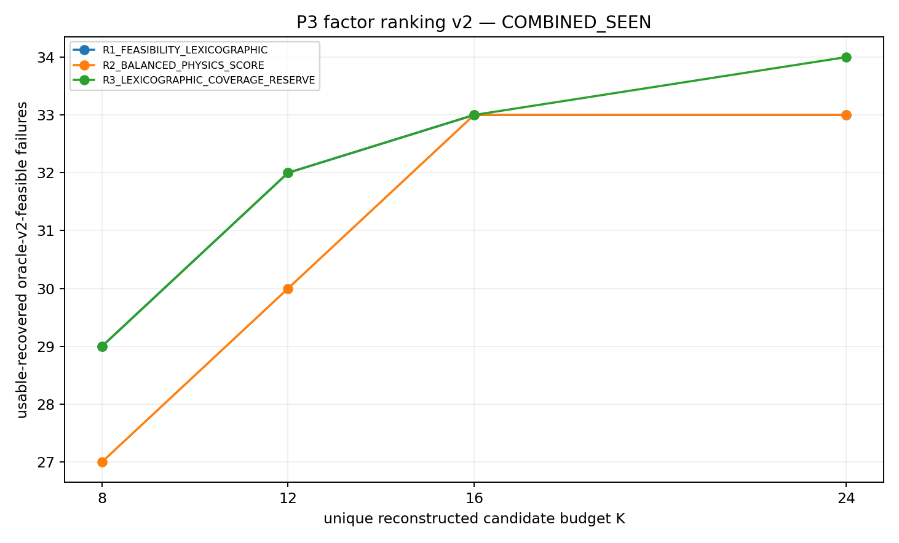
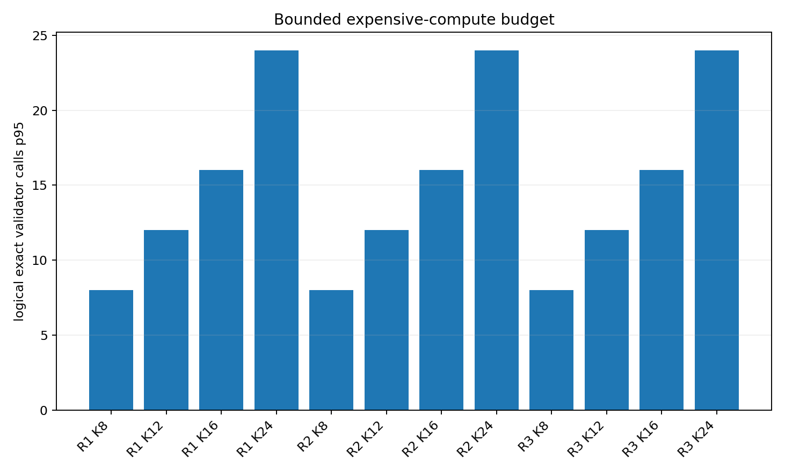

# Geometry-conditioned factor ranking / Top-K P3 — method v2

## 결론

**GO**다. Seen-only v2 candidate로 `R3_LEXICOGRAPHIC_COVERAGE_RESERVE_K12`를 동결했다. Primary USABLE recovery는 combined seen에서 frozen H4-B K12의 `22/36 = 61.1%`에서 **`32/36 = 88.9%`**로 증가했다. Hard recovery는 `30/48 → 36/48`이다.

K16은 usable `33/36`으로 한 건만 더 회복하므로 K12를 선택했다. 이 결정은 final holdout 성능 주장이 아니라 **holdout에 한 번 평가할 method freeze**다. `FINAL_HOLDOUT_UNSEEN`은 열거나 실행하지 않았다.

## Scope와 freeze gate

사용한 데이터는 이미 seen인 세 집합뿐이다.

- `PILOT_SEEN_DEVELOPMENT_DATA`: 9
- `DEVELOPMENT`: 40
- `VALIDATION_SEEN_AFTER_V1`: 37

Frozen authority는 모두 일치했다.

| authority | SHA-256 |
|---|---|
| Reference Oracle v2 spec | `62b63b8ab05d5a73565398141bd05a9db4a102541855fb2e3634d85b18a6bffe` |
| Evaluation contract | `226b1b44a9bea6adf26715658f36ae8e7b2c322e030f363270728f9e044b1dad` |
| Dataset split manifest | `c57cfe8e57dfca4bb318d30047e8f7215f6994e88a39babfbdbb10ce7637b2f4` |
| Exact C++ harness | `8b23f2b6df54c2e93794ee087f3ebd7a14f9921544af4f97eef755535e045e7e` |

Split manifest는 hash gate로만 읽었고 structured row를 load하지 않았다. Holdout row load/run count는 0이다.

## 변경하지 않은 것

- production planner source/config
- P3 family와 five-knot station semantics
- analytic solver
- validator와 production ranker
- vehicle/collision parameter
- lifecycle, fallback, speed shaping
- frozen HARD/USABLE definition

Offline research script와 study artifact만 추가했다. Build, commit, merge, push는 하지 않았다.

## Expanded factor space

`L=(side,d_target,d_mid)`는 production analytic/root 결과를 보존하면서 strict corridor component fraction, production-target local offset, corridor-center trend, target-to-center interpolation, target-relative midpoint offset을 추가한다. `T=(entry,exit)`는 같은 evaluator에서 production이 실제 생성한 exact transition pair만 쓴다.

Oracle `d_target/d_mid`를 online rule에 직접 삽입하지 않았다. Oracle 좌표는 생성 rule이 어떤 miss를 덮는지 사후 진단에만 썼다. Exact 식은 [expanded_lateral_factor_spec.md](expanded_lateral_factor_spec.md), machine-readable 값은 [factor_space_spec.json](factor_space_spec.json)에 있다.

## Preconstruction ranking

세 hypothesis를 평가했다.

- R1: feasibility lexicographic
- R2: weighted balanced physics score
- R3: R1 10개 + coverage 2개 reserve at K12

Proxy는 reference-waypoint station에서 cheap harmonic/quintic `d(s)`를 평가해 corridor violation, slope demand, curvature demand, center error, clearance, exit-obstacle conflict를 계산한다. Cartesian path, footprint, speed shaping, exact validator는 top-K 전에는 실행하지 않는다.

상세 feature는 [geometry_feature_spec.md](geometry_feature_spec.md), 세 순위는 [ranking_hypotheses.md](ranking_hypotheses.md)다.

## Primary recovery

### USABLE_VALID

| method | K | DEVELOPMENT | VALIDATION_SEEN_AFTER_V1 | combined seen |
|---|---:|---:|---:|---:|
| frozen H3 | 24 | 8/17 | 10/19 | 18/36 |
| frozen H4-A | 24 | 11/17 | 11/19 | 22/36 |
| frozen H4-B | 12 | 11/17 | 11/19 | 22/36 |
| R1 | 12 | 14/17 | 18/19 | 32/36 |
| R2 | 12 | 13/17 | 17/19 | 30/36 |
| **selected R3** | **12** | **14/17** | **18/19** | **32/36** |
| Reference Oracle v2 | finite exhaustive domain | 17/17 | 19/19 | 36/36 |

### HARD_VALID

| method | K | DEVELOPMENT | VALIDATION_SEEN_AFTER_V1 | combined seen |
|---|---:|---:|---:|---:|
| frozen H3 | 24 | 13/23 | 14/25 | 27/48 |
| frozen H4-A | 24 | 16/23 | 14/25 | 30/48 |
| frozen H4-B | 12 | 16/23 | 14/25 | 30/48 |
| **selected R3** | **12** | **17/23** | **19/25** | **36/48** |
| Reference Oracle v2 | finite exhaustive domain | 23/23 | 25/25 | 48/48 |

원자료는 [recovery_by_budget.csv](recovery_by_budget.csv), baseline은 [frozen_baseline_comparison.csv](frozen_baseline_comparison.csv)다.

## K ablation

Selected R3의 combined seen 결과:

| K | usable | hard |
|---:|---:|---:|
| 8 | 29/36 | 31/48 |
| **12** | **32/36** | **36/48** |
| 16 | 33/36 | 38/48 |
| 24 | 34/36 | 39/48 |

K12에서 K16으로 늘려도 usable gain은 1/36뿐이다. 따라서 simpler K12를 freeze했다.

## Known failure modes

Selected R3 K12는 usable-feasible seen taxonomy에서:

- candidate-budget truncation: **3/3** — DVE029, DVE039, VUE025
- probe/root/`d_mid` selection: **5/6**
- multi-parameter/factor coverage: **3/5**

네 predeclared budget case의 해석은 다음과 같다.

| event | Oracle-v2 usable? | R3 K12 | 무엇이 달라졌나 |
|---|---:|---:|---|
| DVE029 | yes | recovered | production target + corridor-center 1/4 mid, feasibility rank 1 |
| DVE039 | yes | recovered | target `-0.02 m`, mid `+0.15 m` coverage factor가 reserved rank 12에 진입 |
| VUE013 | **no** | hard miss | Oracle v2 hard path 6개도 모두 next-obstacle exit conflict라 primary usable 분모가 아님 |
| VUE025 | yes | recovered | production target `+0.06 m`, target-center `7/16` mid, existing transition과 새 cross-factor 결합 |

이는 old oracle tuple을 복사한 것이 아니다. 예를 들어 VUE025의 selected path `(d_target,d_mid,entry,exit)=(0.21,0.34463,0.51458,3.53489)`는 Reference Oracle v2의 best tuple `(0.15,0.3125,0.71367,2.22226)`와 다르다.

상세는 [recovery_by_failure_mechanism.csv](recovery_by_failure_mechanism.csv)와 [target_case_factor_space_audit.csv](target_case_factor_space_audit.csv)다.

## Remaining misses

Selected R3 K12의 usable miss는 DVE002, DVE005, DVE022, VUE035 네 개다.

- DVE002: R1 K12에서는 회복되지만 two-slot coverage reserve와 상호작용해 탈락
- DVE005: R1/R3의 더 큰 K에서 회복
- DVE022: expanded full pool usable 58개, 첫 usable rank 51–64
- VUE035: expanded full pool usable 32개, coverage rank 16이지만 K12 coverage quota는 2

따라서 현재 네 miss는 설명 가능한 ranking/quota failure다. P3-family expressiveness나 factor-space 부재라고 분류하지 않는다.

## Compute budget

DEVELOPMENT+VALIDATION seen의 77 failure event, selected K12:

| quantity | total | per event max |
|---|---:|---:|
| cheap lateral-factor evaluations | 104,155 | 4,471 seen max |
| cheap pair-priority evaluations | 694,600 | 71,506 seen max |
| fully reconstructed P3 | **924** | **12** |
| unique digest / logical exact validator | **852** | **12** |
| duplicate reconstructed paths | 72 | — |

K는 fully reconstructed candidate 수다. Digest duplicate는 K를 소비하지만 validator 중복은 제거한다. 기존 retained cap 24 또는 callback-global production validator count와 혼동하면 안 된다. 전체 수치는 [expensive_compute_budget.csv](expensive_compute_budget.csv)다.

## Production-first success controls

Seen strict production-success control 18개는 모두 production result를 그대로 사용한다.

- v2 invocation: 0/18
- 추가 factor/pair/reconstruction/validator: 0
- selected path change: 0/18
- production digest parity: 18/18

즉 regression 방지는 v2 standalone equivalence가 아니라 production-first activation contract에 의해 보장된다. [success_control.csv](success_control.csv)에 control별 기록이 있다.

## Multi-domain evidence

Selected R3 K12 usable recovery 32개는 세 recorded input domain에 `12, 12, 8`로 분포한다. 특정 bag 하나의 gain은 아니다. 다만 모두 seen data이고 동일 reference snapshot 계열이 일부 반복되므로 독립적인 실제 환경 일반화 증거는 아니다.

## Oracle-v2 sensitivity

Sensitivity는 frozen Oracle v2의 합리적인 **subset** variant에서 이미 exact-validation된 witness가 유지되는지 검사했다. Variant 전체를 새로 exhaustive rerun하지 않았으므로 결과는 exact-witness lower bound이며, witness가 빠진 사례를 negative로 재분류하지 않고 `INCONCLUSIVE`로 둔다.

Combined seen USABLE:

| variant | exact witness retained | R3 recovery among retained | 해석 |
|---|---:|---:|---|
| baseline 0.01 / ±1.5 / all T / factor anchors | 36/36 | 32/36 | authority |
| grid 0.02 | 34/36, 2 inconclusive | 30/34 | recovery ratio 실질적으로 동일 |
| `d_mid` ±1.25 | 36/36 | 32/36 | 변화 없음 |
| minimum transition pair only | 18/36, 18 inconclusive | 14/18 | **transition set에 민감** |
| frozen factor anchors 제거 | 34/36, 2 inconclusive | 31/34 | retained subset에서 순위 결론 역전 없음 |

따라서 grid/bound/factor-anchor reasonable subset에서는 selected-vs-H4-B의 큰 seen gain이 역전된 증거가 없다. 반면 transition set을 한 pair로 줄이면 oracle upper-bound 분모 자체가 절반만 exact witness로 유지되므로 **all production transition pairs라는 Oracle-v2 정의는 중요**하다. Continuous-space completeness는 주장하지 않는다. [oracle_v2_sensitivity.csv](oracle_v2_sensitivity.csv)와 event-level [oracle_v2_sensitivity_events.csv](oracle_v2_sensitivity_events.csv)에 근거가 있다.

## Method selection gate

1. H4-B K12보다 meaningful usable gain: **PASS**, +10/36
2. bounded expensive budget: **PASS**, reconstruction 12, validator ≤12
3. multiple bags/domains: **PASS**, 세 bag
4. explainable remaining misses: **PASS**, 네 건 모두 rank/quota
5. production-first regression: **PASS**, 18/18 skip/no change
6. K12/16 preference: **K12 선택**, K16 추가 usable 1건

따라서 v2는 GO지만, 다음 허용 단계는 frozen spec을 그대로 `FINAL_HOLDOUT_UNSEEN`에 **한 번** 적용하는 것이다. 이번 작업은 그 직전에서 중단했다.

## Frozen files

- [selected_v2_method_spec.md](selected_v2_method_spec.md)
- [selected_v2_method_spec.json](selected_v2_method_spec.json)
- [factor_space_spec.json](factor_space_spec.json)
- [run_factor_ranking_v2.py](run_factor_ranking_v2.py)
- [execution_manifest.json](execution_manifest.json)

각 SHA sidecar는 같은 directory에 있다.

- selected method policy SHA: `7b861e8c7e23ae168413885ea0dc2d09769046ff48a562700b658e084d116fcc`
- factor-space SHA: `949971060ad43d09eb859030409076bd36f14a9f544fd36a784b9413e900b2e6`
- offline implementation SHA: `2cd87b4c9faf9e9f84c96295f137b4edeed21fafc9abeccf48298b603f075c03`
